# ComfyUI-Hive


[](https://github.com/luguoli)
[](https://github.com/comfyanonymous/ComfyUI)

**English** | [简体中文](README.md)


**ComfyUI Community Communication and Resource Sharing Platform**

ComfyUI-Hive is a community plugin designed for ComfyUI users, allowing you to:
- 💬 **Real-time communication with global users**: Chat and share works with other ComfyUI users in real-time across multiple channels
- 🎨 **Discover creative inspiration**: Browse, search, and favorite quality works, workflows, nodes, models, and tutorials from the community
- 📥 **Easy resource access**: Can't access node GitHub links? Can't access HuggingFace? Don't know how to install nodes? Don't know how to download models? Don't worry! Built-in mirror addresses, built-in node installer and model downloader, one-click download models and install nodes, no manual operation required
- 🔄 **Share workflows**: Don't know how to generate that image you like? Load it to the canvas with one click
- 🖱️ **Powerful context menu**: Right-click to use expand prompt, random prompt, photo prompt generator, prompt favorite, AI chat, translate, reverse prompt, and fix node features

#### If this project helps you, please give it a ⭐Star — it lets me know there are humans out there using it!

## 📋 Table of Contents

- [What Can I Do?](#what-can-i-do)
- [Quick Start](#quick-start)
- [Feature Details](#feature-details)
- [FAQ](#faq)
- [Contact](#contact)

## What Can I Do?

### 💬 Join Community Chat

Open ComfyUI-Hive Hub / Club, and you'll see multiple chat channels. Each channel has a different theme, and you can choose channels that interest you:

- **Real-time chat**: Messages are delivered instantly, as smooth as using instant messaging software
- **View online users**: Each channel displays how many people are currently online
- **Share works**: Directly upload images or workflow files to share your creations with everyone. Liked images and workflows can be loaded to the canvas with one click, so you'll never worry about not knowing how to set them up
- **Get help**: Encountered a problem? Ask in the channel, and helpful community members will assist you

### 🎨 Browse Inspiration Square

Inspiration Square is a rich content resource library where you can:

- **Discover quality works**: Browse images, workflows, models, etc. shared by other users
- **Quick search**: Enter keywords to quickly find what you need
- **Precise filtering**: Filter content by category (Image/Video/Workflow/Model/Node/Tutorial) and tags
- **Multiple sorting options**: Sort by latest, most likes, most favorites to discover popular content
- **Favorite liked content**: Found a work you like? Click favorite to view it later
- **Like to support**: Like quality content to help more people see it

### 📤 Share Your Workflow

When you want to share a workflow, there are two ways:

1. **Upload workflow JSON file**: Directly upload a `.json` file
2. **Share image with workflow**: If the image was saved with ComfyUI, the system will automatically detect and ask if you want to include the workflow

Other users just need to click the "Load Workflow" button to load the workflow to their ComfyUI canvas with one click - extremely convenient!

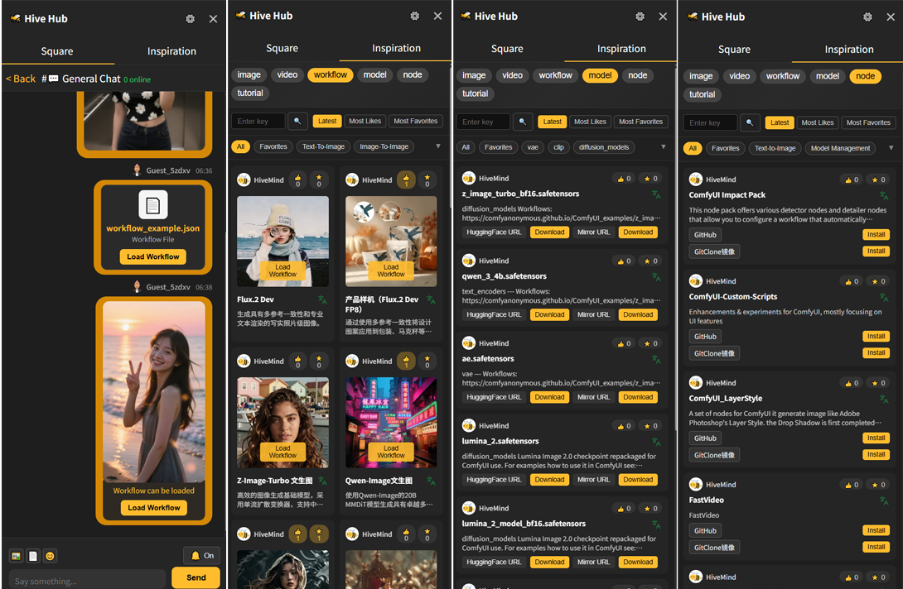

### 📥 Easy Model Download

No more manual model file downloads! Use the model downloader node:

1. Copy the model download link
2. Select the save directory (checkpoints, loras, vae, etc.)
3. Click download and wait for completion

The system will automatically handle everything, including:
- Multi-threaded accelerated download
- Display download progress
- Automatic save to correct location
- Detect if file already exists to avoid duplicate downloads

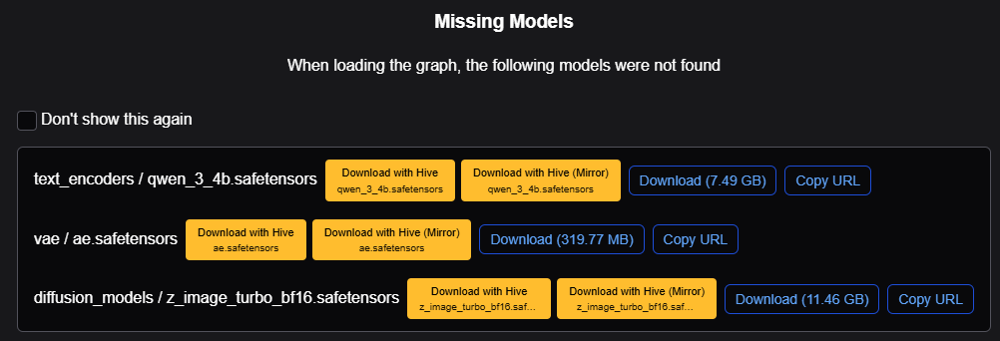
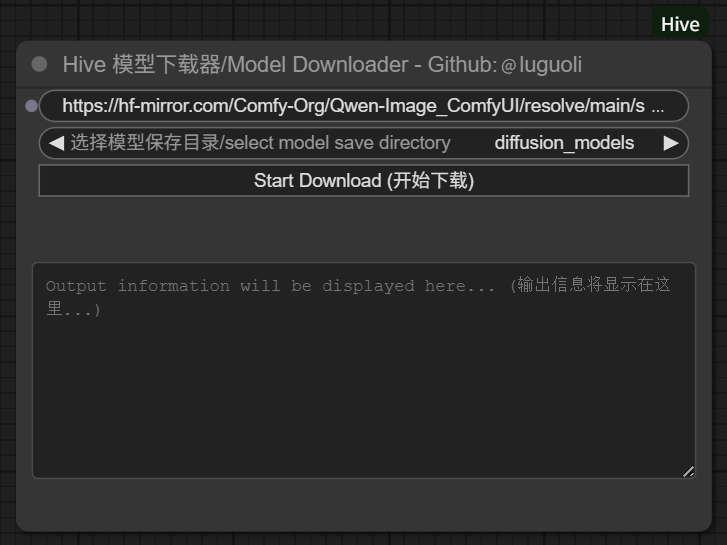


### 📦 One-Click Node Installation

Found a useful node recommended by others? Use the node installer, just:

1. Copy the node's GitHub/GitLab/Gitee link
2. Click the install button
3. Wait for installation to complete
4. Restart ComfyUI to use it

Supports both Git repositories and ZIP files. The system will automatically identify and handle them.

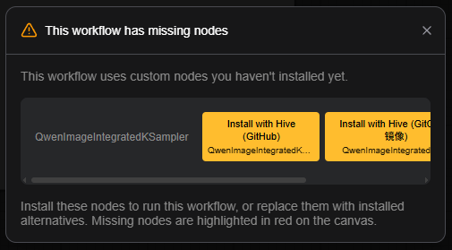
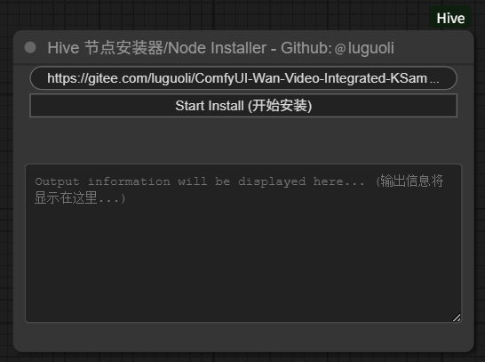

### 🖱️ Context Menu Features

Hive provides rich context menu features to make your workflow more efficient:

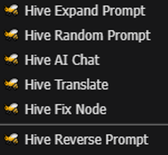

1. Expand Prompt

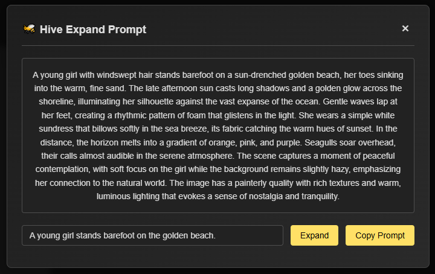

2. Random Prompt

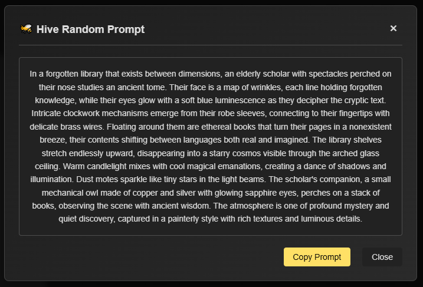

3. Photo Prompt Generator

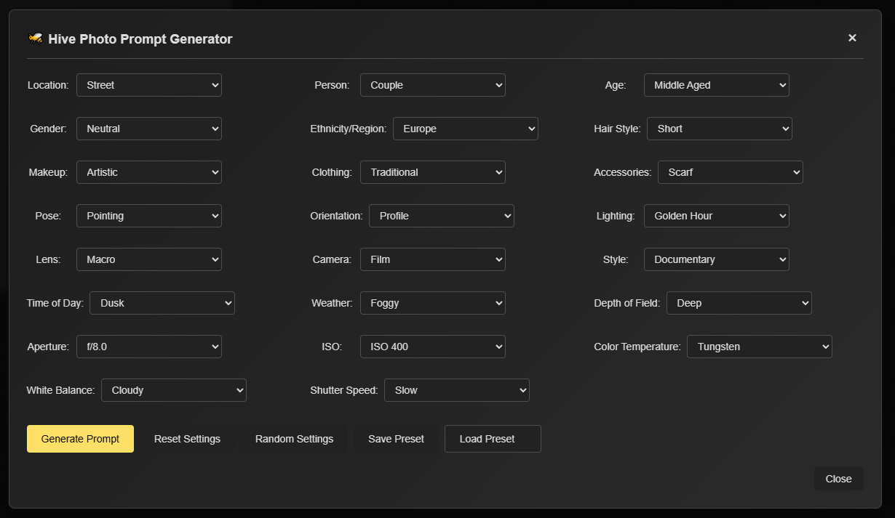

4. Prompt Favorite, Collect and manage commonly used prompts with category management, edit/delete, export/import, category filtering, and more to build your personal prompt library.

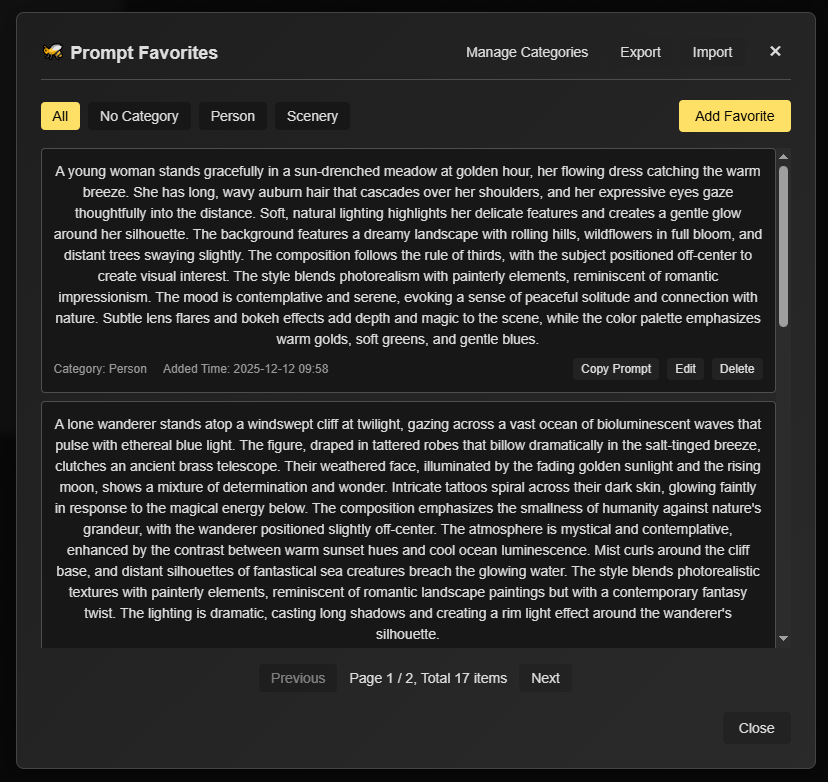

5. AI Chat

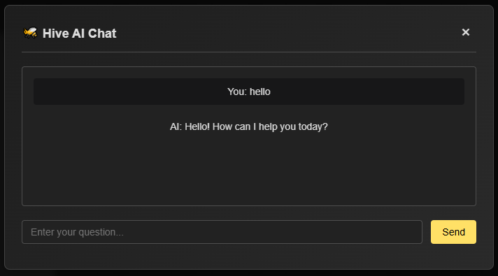

6. Translate

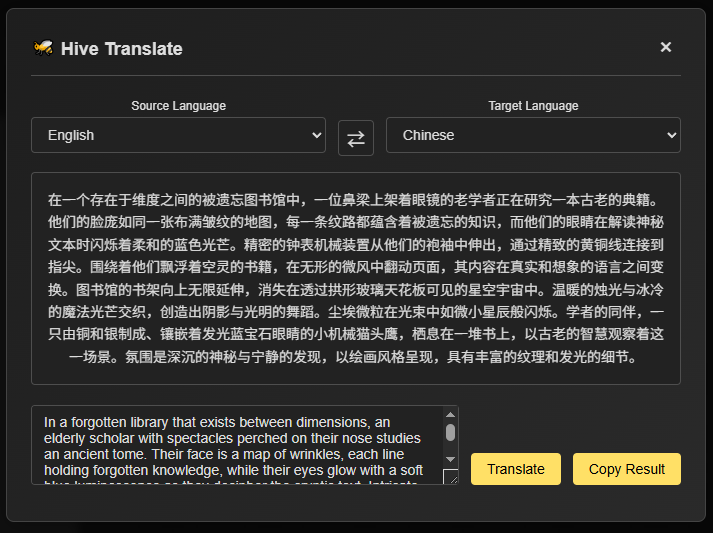

7. Fix Node

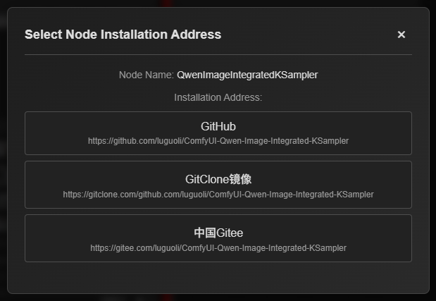

8. Reverse Prompt

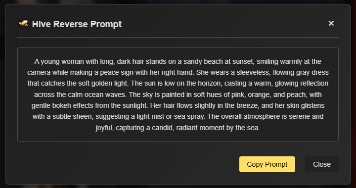

All AI features require configuring the Large Language Model API first (configure in settings).

## Quick Start

### Step 1: Install the Plugin

**Method 1: Through ComfyUI Manager (Recommended)**
1. Open ComfyUI Manager in the ComfyUI interface
2. Search for "ComfyUI-Hive"
3. Click Install

**Method 2: Using Git**
```bash
cd ComfyUI/custom_nodes
git clone https://github.com/luguoli/ComfyUI-Hive.git
Or Gitee repository (Mainland China):
git clone https://gitee.com/luguoli/ComfyUI-Hive.git
```

**Method 3: Manual Installation**
1. Download the project ZIP file and extract it
2. Place the folder in the `ComfyUI/custom_nodes/` directory
3. Note that the folder name should be changed to `ComfyUI-Hive`

### Step 2: Start ComfyUI

Restart ComfyUI, and you'll see a **🐝 Hive** button on the right side of the interface.

### Step 3: Start Using

Click the **🐝 Hive** button to open the Hive Hub sidebar and start using all features!

## Feature Details

### 💬 Chat Feature Guide

**Enter Channel**
- After opening Hive Hub, you'll see the "Square" view showing all available chat channels
- Each channel displays the current number of online users
- Click any channel to enter chat

**Send Messages**
- Enter text in the input box at the bottom of the chat interface and click the "Send" button
- Supports uploading images (PNG/JPG/WebP) and workflow JSON files
- Click the 📎 button above the input box to select files

**Share Workflow**
- When uploading images, if the image contains workflow data, the system will ask if you want to include the workflow
- After selecting "Yes", recipients will see the "Load Workflow" button on the image
- Users can click the button to load it to their canvas with one click

**View History Messages**
- Scroll up in the chat window to automatically load earlier messages
- The system will automatically fill in messages missed during disconnection

### 🎨 Inspiration Square Guide

**Switch View**
- Click the "Inspiration" tab at the top of Hive Hub to switch to Inspiration Square

**Browse Content**
- Top has category buttons (Image/Video/Workflow/Model/Node/Tutorial), click to switch categories
- Each category can be further filtered by tags
- Supports sorting by "Latest", "Most Likes", "Most Favorites"

**Search Function**
- Enter keywords in the search box and click search or press Enter
- Can search titles, descriptions, etc.

**Interaction Features**
- **Like**: Click 👍 button to like content
- **Favorite**: Click ⭐ button to favorite content, view in "Favorites" filter
- **View Details**: Click content card to view detailed information

### 📥 Model Downloader Guide

1. Find **Hive** → **Model Downloader** in the node list
2. Paste the model download link into the "Model URL" input box
3. Select save directory from dropdown menu (checkpoints, loras, vae, etc.)
4. Click "Start Download" button
5. Wait for download to complete (check progress bar)
6. **Important**: After download completes, restart ComfyUI to use the new model

**Tips**:
- If file already exists, the system will prompt and skip download
- Supports multi-threaded download for faster large file downloads
- Can view real-time progress during download

### 📦 Node Installer Guide

1. Find **Hive** → **Node Installer** in the node list
2. Paste the node link into the "Node Installation Address" input box
   - Supports GitHub, GitLab, Gitee, and other platforms
   - Also supports ZIP file links
3. Click "Start Install" button
4. Wait for installation to complete
5. **Important**: After installation completes, restart ComfyUI to use the new node

**Tips**:
- If node already exists, the system will automatically try to update
- Installing Git repositories requires Git tool to be installed on the system

### 🖱️ Context Menu Features

Hive provides rich context menu features to make your workflow more efficient:

1. **🐝 Hive Expand Prompt**
   - Enter a prompt, and AI will automatically expand it to generate more detailed and rich prompts
   - Supports expanding prompts in both Chinese and English
   - After expansion, you can directly copy and use the result

2. **🐝 Hive Random Prompt**
   - Generate random prompts with one click to inspire creativity
   - Generated prompts include both Chinese and English versions
   - Perfect for scenarios where you need quick prompt inspiration

3. **🐝 Hive Photo Prompt Generator**
   - Professional photography-style prompt generation tool
   - Supports rich photography parameter settings: location, person, age, gender, hairstyle, makeup, clothing, pose, orientation, lighting, lens, camera, style, time, weather, etc.
   - Supports photography technical parameters: ISO, aperture, shutter speed, color temperature, white balance, depth of field, etc.
   - Can save and load presets for easy reuse
   - Supports random settings and recommended settings for quick prompt generation
   - Generated prompts can be directly copied and used

4. **🐝 Hive Prompt Favorite**
   - Collect and manage commonly used prompts
   - Supports category management, create multiple categories to organize favorites
   - Supports editing and deleting favorites, update content anytime
   - Supports category filtering to quickly find needed prompts
   - Supports export and import for easy backup and sharing
   - One-click copy prompt to clipboard

5. **🐝 Hive AI Chat**
   - Chat with AI to get creative suggestions and help
   - Can ask questions about ComfyUI usage, workflow optimization, etc.
   - Supports multi-turn conversations

6. **🐝 Hive Translate**
   - Quickly translate prompts or text content
   - Supports translation between Chinese and English
   - Translation results can be directly copied and used

7. **🐝 Hive Fix Node**
   - When a node is missing or unusable, right-click on the node
   - The system will automatically search for the node's installation address
   - If there are multiple installation addresses, you can choose the appropriate one to install
   - One-click fix for missing nodes

8. **🐝 Hive Reverse Prompt**
   - Analyze image content and automatically generate corresponding prompts
   - Supports generating prompts in both Chinese and English
   - Generated prompts can be directly copied and used
   - Perfect for scenarios where you need to reverse-engineer workflows from images

**Note**: Using AI-related features requires configuring the Large Language Model API first. Configuration method:
1. Click the settings button in the sidebar
2. Click the "Configure LLM API" button
3. In "Large Language Model API Configuration", select a provider and fill in the API Key
4. Select a model and save the configuration

### ⚙️ Personalization Settings

Click the ⚙️ button at the top of Hive Hub to open settings:

- **Edit Profile**: Change nickname, change avatar
- **Language Settings**: Switch Chinese/English interface, or select "Follow System"
- **Auto Translate**: When enabled, received messages not in current language will be automatically translated
- **Message Notifications**: Enable/disable sound notifications
- **Submit Feedback**: Encountered a problem or have a suggestion? Submit feedback here

## FAQ

### 💬 Chat Related Questions

**Q: After opening Hive Hub, it shows connection failed?**

A: This is usually due to network connection issues. Please check:
- Whether network connection is normal
- Whether internet access is normal
- If the problem persists, try refreshing the page or restarting ComfyUI

**Q: Unable to send messages?**

A: Possible reasons:
- Unstable network connection, wait for automatic reconnection
- Messages sent too quickly, please try again later

**Q: Image upload failed, prompted as containing inappropriate content?**

A: To protect the community environment, the system automatically detects image content. If your image is misjudged, you can:
- Try adjusting the image before uploading
- Contact administrator to explain the situation

**Q: How to share workflow?**

A: There are two ways:
1. Upload workflow JSON file
2. Upload image containing workflow (ComfyUI saved images are automatically detected)

After receiving, users can click the "Load Workflow" button on the image.

**Q: How to switch interface language?**

A: Click the ⚙️ button at the top of Hive Hub, select language in settings. Supports Chinese and English.

**Q: How to use message auto-translation?**

A: Enable "Auto Translate Messages" in settings. When enabled, received messages not in current language will be automatically translated. Requires network connection.

### 📥 Download and Installation Issues

**Q: Model download failed?**

A: Please check:
- Whether download link is correct
- Whether network connection is normal
- Whether disk space is sufficient
- Whether target directory has write permissions

**Q: Can't find model after download completes?**

A: After download completes, you need to **restart ComfyUI** for the model to appear in the list.

**Q: Node installation failed?**

A: Possible reasons:
- If installing Git repository, Git tool needs to be installed first ([Download Git](https://git-scm.com/))
- Network connection issues, please check network
- Incorrect link format, ensure it's a valid GitHub/GitLab/Gitee link

**Q: Node doesn't appear after installation?**

A: After installation completes, you need to **restart ComfyUI**. If it still doesn't appear after restart:
- Check if node is correctly installed
- Check ComfyUI console for error messages
- Some nodes may require additional dependencies, please check node documentation

**Q: How to update an already installed node?**

A: If the node was installed via Git, run the node installer again with the same link, and the system will automatically update. If update fails, you may need to manually delete the node and reinstall.

**Q: What download links are supported?**

A: Supports all standard HTTP/HTTPS download links. For large files, if the server supports it, multi-threaded accelerated download will be automatically used.


## Contact

- **Author**: @luguoli (墙上的向日葵)
- **GitHub**: https://github.com/luguoli
- **Email**: luguoli@vip.qq.com

---

**Note**: When using this plugin, please ensure compliance with relevant model and node usage license agreements.


---

**Made with ❤️ for the ComfyUI community**
