# ComfyUI-Hive


[](https://github.com/luguoli)
[](https://github.com/comfyanonymous/ComfyUI)

[English](README-en.md) | **简体中文**


**ComfyUI 社区交流与资源共享平台**

ComfyUI-Hive 是一个专为 ComfyUI 用户打造的社区插件，让您能够：
- 💬 **与全球用户实时交流**：在多个频道中实时与其他 ComfyUI 用户聊天、分享作品
- 🎨 **发现创作灵感**：浏览、搜索、收藏来自社区的优质作品、工作流、节点、模型、教程
- 📥 **轻松获取资源**：节点GitHub地址打不开？huggingface打不开？不会安装节点？不会下载模型？全都不用担心了！自带镜像地址，自带节点安装器、模型下载器，一键下载模型、安装节点，无需手动操作
- 🔄 **分享工作流**：喜欢的图片不知道怎么生成的？一键加载到画布
- 🖱️ **强大的右键菜单**：右键即可使用提示词扩写、随机提示词、摄影提示词生成器、提示词收藏、AI对话、翻译、提示词反推、节点修复、提取工作流等功能

#### 如果这个项目对您有帮助，请点个 ⭐Star 吧，让我知道世界上还有人类在使用它！

## 📋 目录

- [我能做什么？](#我能做什么)
- [快速开始](#快速开始)
- [功能详解](#功能详解)
- [常见问题](#常见问题)
- [联系方式](#联系方式)

## 我能做什么？

### 💬 加入社区聊天

打开 ComfyUI-Hive Hub / Club，您会看到多个聊天频道。每个频道都有不同的主题，您可以选择感兴趣的频道加入：

- **实时聊天**：消息即时送达，就像使用即时通讯软件一样流畅
- **查看在线人数**：每个频道都会显示当前有多少人在线
- **分享作品**：直接上传图片或工作流文件，与大家分享您的创作，喜欢的图片和工作流，一键加载到画布，再也不用担心不会搭建了
- **获取帮助**：遇到问题？在频道中提问，热心的社区成员会帮助您

### 🎨 浏览灵感广场

灵感广场是一个内容丰富的资源库，您可以：

- **发现优质作品**：浏览其他用户分享的图片、工作流、模型等
- **快速搜索**：输入关键词，快速找到您需要的内容
- **精准筛选**：按分类（图片/视频/工作流/模型/节点/教程）、标签筛选内容
- **多种排序**：按最新发布、最多点赞、最多收藏排序，发现热门内容
- **收藏喜欢的内容**：遇到喜欢的作品？点击收藏，方便以后查看
- **点赞支持**：为优质内容点赞，让更多人看到

### 📤 分享您的工作流

当您想分享一个工作流时，有两种方式：

1. **上传工作流 JSON 文件**：直接上传 `.json` 文件
2. **分享包含工作流的图片**：如果图片是用 ComfyUI 保存的，系统会自动检测并询问是否携带工作流

其他小伙伴只需点击"加载工作流"按钮，就能一键将工作流加载到自己的 ComfyUI 画布上，极其方便！

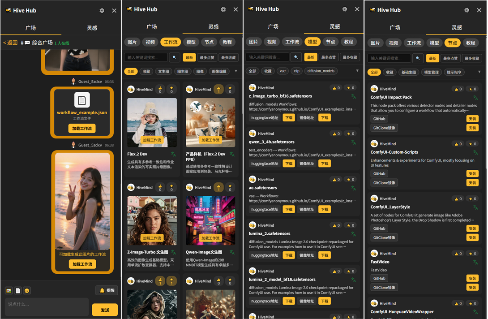

### 📥 轻松下载模型

不再需要手动下载模型文件！使用模型下载器节点：

1. 复制模型下载链接
2. 选择保存目录（checkpoints、loras、vae 等）
3. 点击下载，等待完成

系统会自动处理一切，包括：
- 多线程加速下载
- 显示下载进度
- 自动保存到正确位置
- 检测文件是否已存在，避免重复下载


### 📦 一键安装节点

看到别人推荐的好用节点？使用节点安装器，只需：

1. 复制节点的 GitHub/GitLab/Gitee 链接
2. 点击安装按钮
3. 等待安装完成
4. 重启 ComfyUI 即可使用

支持 Git 仓库和 ZIP 文件两种方式，系统会自动识别并处理。

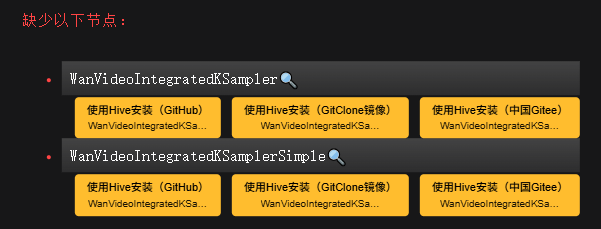


### 🖱️ 右键菜单功能

Hive 提供了丰富的右键菜单功能，让您的工作流更加高效：

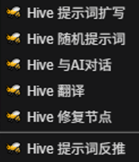

1. 提示词扩写

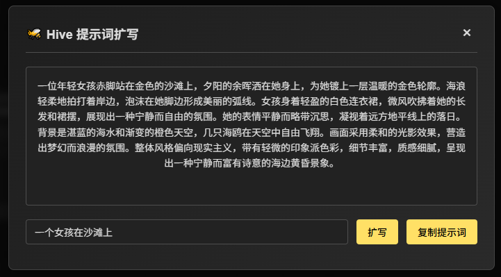

2. 随机提示词

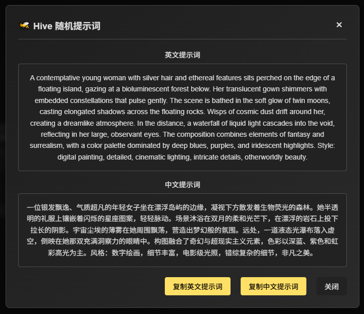

3. 摄影提示词生成器


4. 提示词收藏，收藏和管理常用的提示词，支持分类管理、编辑删除、导出导入、分类筛选等功能，建立个人提示词库。

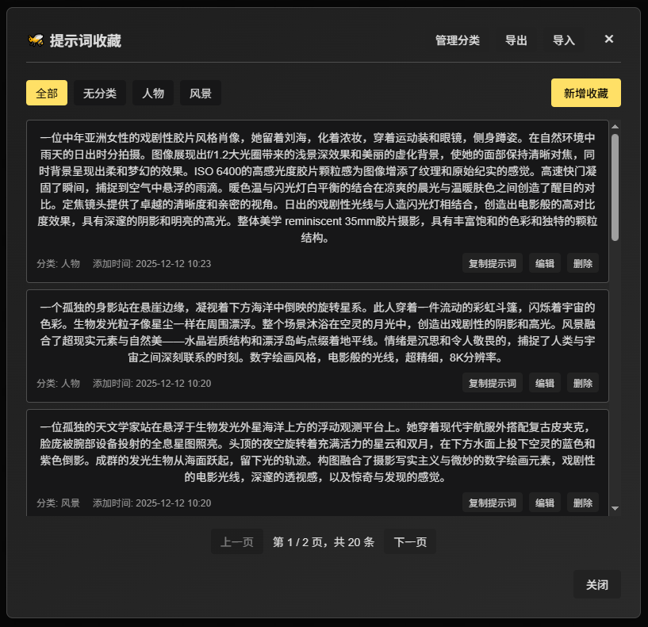


5. 与AI对话

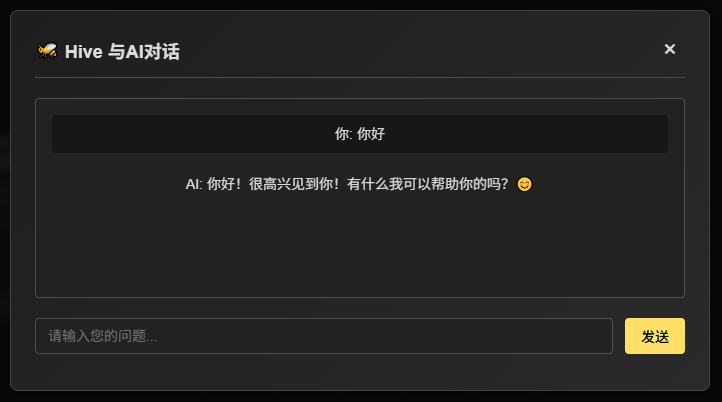

6. 翻译

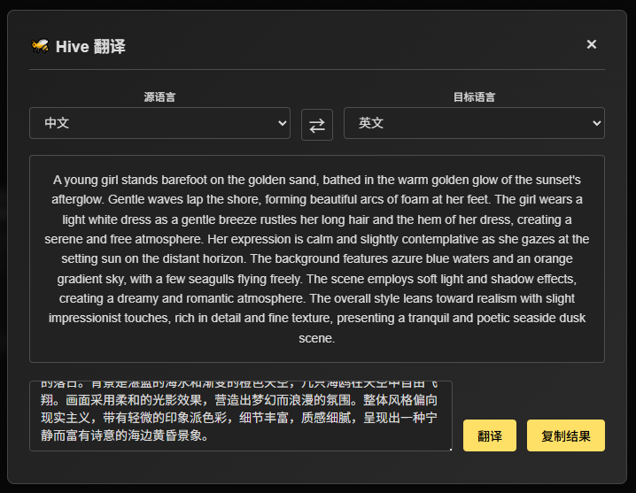

7. 修复节点

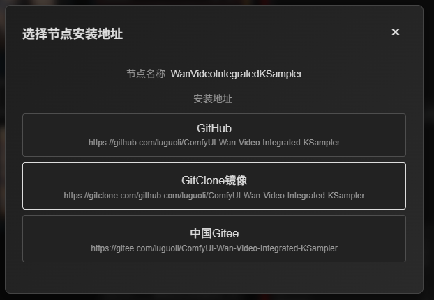

8. 提示词反推

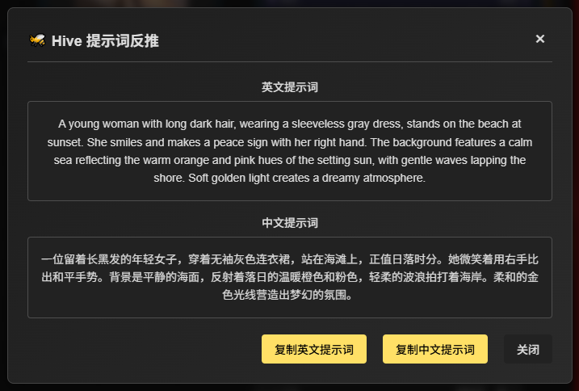

9. 提取工作流

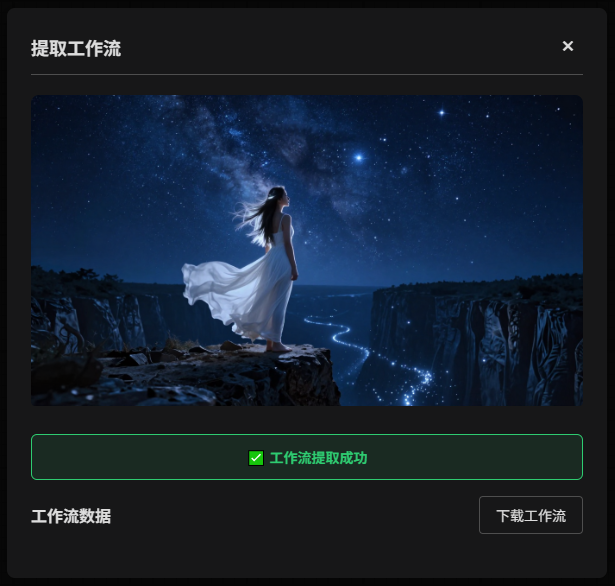

所有 AI 功能需要先配置大语言模型 API（在设置中配置）。


## 快速开始

### 第一步：安装插件

**方法1：通过ComfyUI管理器（推荐）**
1. 在ComfyUI界面中打开ComfyUI管理器
2. 搜索 "ComfyUI-Hive"
3. 点击安装

**方法2：使用 Git**
```bash
cd ComfyUI/custom_nodes
git clone https://github.com/luguoli/ComfyUI-Hive.git
或 Gitee 仓库（中国大陆）：
git clone https://gitee.com/luguoli/ComfyUI-Hive.git
```

**方法3：手动安装**
1. 下载项目 ZIP 文件并解压
2. 将文件夹放到 `ComfyUI/custom_nodes/` 目录下
3. 注意将文件夹名改为 `ComfyUI-Hive`

### 第二步：启动 ComfyUI

重启 ComfyUI，您会在界面右侧看到一个 **🐝 Hive** 按钮。

### 第三步：开始使用

点击 **🐝 Hive** 按钮，打开 Hive Hub 侧边栏，就可以开始使用所有功能了！

## 功能详解

### 💬 聊天功能使用指南

**进入频道**
- 打开 Hive Hub 后，您会看到"广场"视图，显示所有可用的聊天频道
- 每个频道显示当前在线人数
- 点击任意频道即可进入聊天

**发送消息**
- 在聊天界面底部的输入框输入文字，点击"发送"按钮
- 支持上传图片（PNG/JPG/WebP）和工作流 JSON 文件
- 点击输入框上方的 📎 按钮选择文件

**分享工作流**
- 上传图片时，如果图片包含工作流数据，系统会询问是否携带工作流
- 选择"是"后，接收方就能在图片上看到"加载工作流"按钮
- 小伙伴点击按钮即可一键加载到自己的画布

**查看历史消息**
- 向上滚动聊天窗口，会自动加载更早的消息
- 系统会自动补齐断线期间错过的消息

### 🎨 灵感广场使用指南

**切换视图**
- 点击 Hive Hub 顶部的"灵感"标签，切换到灵感广场

**浏览内容**
- 顶部有分类按钮（图片/视频/工作流/模型/节点/教程），点击切换分类
- 每个分类下可以按标签进一步筛选
- 支持按"最新"、"最多点赞"、"最多收藏"排序

**搜索功能**
- 在搜索框输入关键词，点击搜索按钮或按回车
- 可以搜索标题、描述等内容

**互动功能**
- **点赞**：点击 👍 按钮为内容点赞
- **收藏**：点击 ⭐ 按钮收藏内容，在"收藏"筛选中查看
- **查看详情**：点击内容卡片查看详细信息

### 📥 模型下载器使用指南

1. 在节点列表中找到 **Hive** → **模型下载器**
2. 将模型下载链接粘贴到"模型地址"输入框
3. 从下拉菜单选择保存目录（checkpoints、loras、vae 等）
4. 点击"开始下载"按钮
5. 等待下载完成（查看进度条）
6. **重要**：下载完成后重启 ComfyUI 才能使用新模型

**小贴士**：
- 如果文件已存在，系统会提示并跳过下载
- 支持多线程下载，大文件下载更快
- 下载过程中可以查看实时进度

### 📦 节点安装器使用指南

1. 在节点列表中找到 **Hive** → **节点安装器**
2. 将节点链接粘贴到"节点安装地址"输入框
   - 支持 GitHub、GitLab、Gitee 等平台
   - 也支持 ZIP 文件链接
3. 点击"开始安装"按钮
4. 等待安装完成
5. **重要**：安装完成后重启 ComfyUI 才能使用新节点

**小贴士**：
- 如果节点已存在，系统会自动尝试更新
- 安装 Git 仓库需要系统已安装 Git 工具

### 🖱️ 右键菜单功能

Hive 提供了丰富的右键菜单功能，让您的工作流更加高效：

1. **🐝 Hive 提示词扩写**
   - 输入提示词，AI 会自动帮您扩写，生成更详细、更丰富的提示词
   - 支持中英文提示词扩写
   - 扩写完成后可直接复制使用

2. **🐝 Hive 随机提示词**
   - 一键生成随机提示词，激发创作灵感
   - 生成的提示词包含中英文版本
   - 适合需要快速获取提示词灵感的场景

3. **🐝 Hive 摄影提示词生成器**
   - 专业的摄影风格提示词生成工具
   - 支持丰富的摄影参数设置：地点、人物、年龄、性别、发型、妆容、服装、姿势、朝向、灯光、镜头、相机、风格、时间、天气等
   - 支持摄影技术参数：ISO、光圈、快门、色温、白平衡、景深等
   - 可保存和加载预设，方便重复使用
   - 支持随机设定和推荐设定，快速生成提示词
   - 生成的提示词可直接复制使用

4. **🐝 Hive 提示词收藏**
   - 收藏和管理常用的提示词
   - 支持分类管理，创建多个分类来组织收藏
   - 支持编辑和删除收藏，随时更新内容
   - 支持分类筛选，快速找到需要的提示词
   - 支持导出和导入，方便备份和分享
   - 一键复制提示词到剪贴板

5. **🐝 Hive 与AI对话**
   - 与 AI 进行对话，获取创作建议和帮助
   - 可以询问关于 ComfyUI 使用、工作流优化等问题
   - 支持多轮对话

6. **🐝 Hive 翻译**
   - 快速翻译提示词或文本内容
   - 支持中英文互译
   - 翻译结果可直接复制使用

7. **🐝 Hive 修复节点**
   - 当节点缺失或无法使用时，右键点击节点
   - 系统会自动搜索节点的安装地址
   - 如果有多个安装地址，可以选择合适的进行安装
   - 一键修复缺失的节点

8. **🐝 Hive 提示词反推**
   - 分析图片内容，自动生成对应的提示词
   - 支持生成中英文提示词
   - 生成的提示词可直接复制使用
   - 适合从图片反推工作流的场景

9. **🐝 Hive 提取工作流**
   - 提取图片或视频中嵌入的工作流数据
   - 支持 PNG、JPG、WebP 图片和 MP4、MOV 视频
   - 只需拖拽或选择文件，自动提取
   - 提供提取的工作流JSON文件下载按钮
   - 无需配置API，安装后即可使用

**注意**：使用 AI 相关功能需要先配置大语言模型 API。配置方法：
1. 点击侧边栏的设置按钮
2. 点击"配置大模型API"按钮
3. 在"大语言模型API配置"中选择提供商并填写 API Key
4. 选择模型后保存配置

### ⚙️ 个性化设置

点击 Hive Hub 顶部的 ⚙️ 按钮打开设置：

- **修改资料**：更改昵称、更换头像
- **语言设置**：切换中文/英文界面，或选择"跟随系统"
- **自动翻译**：开启后，收到的非当前语言消息会自动翻译
- **消息提醒**：开启/关闭声音提醒
- **提交反馈**：遇到问题或有建议？在这里提交反馈

## 常见问题

### 💬 聊天相关问题

**Q: 打开 Hive Hub 后显示连接失败？**

A: 这通常是因为网络连接问题。请检查：
- 网络连接是否正常
- 是否能正常访问互联网
- 如果问题持续，可以尝试刷新页面或重启 ComfyUI

**Q: 无法发送消息？**

A: 可能的原因：
- 网络连接不稳定，等待自动重连
- 消息发送过快，请稍后再试

**Q: 图片上传失败，提示包含不适宜内容？**

A: 为了保护社区环境，系统会自动检测图片内容。如果您的图片被误判，可以：
- 尝试调整图片后再上传
- 联系管理员说明情况

**Q: 如何分享工作流？**

A: 有两种方式：
1. 上传工作流 JSON 文件
2. 上传包含工作流的图片（ComfyUI 保存的图片会自动检测）

小伙伴收到后，点击图片上的"加载工作流"按钮即可。

**Q: 如何切换界面语言？**

A: 点击 Hive Hub 顶部的 ⚙️ 按钮，在设置中选择语言。支持中文和英文。

**Q: 消息自动翻译怎么用？**

A: 在设置中开启"消息自动翻译"。开启后，收到的非当前语言消息会自动翻译。需要网络连接。

### 📥 下载和安装问题

**Q: 模型下载失败？**

A: 请检查：
- 下载链接是否正确
- 网络连接是否正常
- 磁盘空间是否充足
- 目标目录是否有写入权限

**Q: 下载完成后找不到模型？**

A: 下载完成后需要**重启 ComfyUI**，模型才会出现在列表中。

**Q: 节点安装失败？**

A: 可能的原因：
- 如果安装 Git 仓库，需要先安装 Git 工具（[下载 Git](https://git-scm.com/)）
- 网络连接问题，请检查网络
- 链接格式不正确，确保是有效的 GitHub/GitLab/Gitee 链接

**Q: 节点安装后没有显示？**

A: 安装完成后需要**重启 ComfyUI**。如果重启后仍然没有：
- 检查节点是否正确安装
- 查看 ComfyUI 控制台是否有错误信息
- 某些节点可能需要额外的依赖，请查看节点说明

**Q: 如何更新已安装的节点？**

A: 如果节点是通过 Git 安装的，再次运行节点安装器并输入相同的链接，系统会自动更新。如果更新失败，可能需要手动删除节点后重新安装。

**Q: 支持哪些下载链接？**

A: 支持所有标准的 HTTP/HTTPS 下载链接。对于大文件，如果服务器支持，会自动使用多线程加速下载。


## 联系方式

- **作者**：@luguoli（墙上的向日葵）
- **GitHub**: https://github.com/luguoli
- **Email**: luguoli@vip.qq.com

---

**提示**：使用本插件时，请确保遵守相关模型和节点的使用许可协议。


---

**用❤️为ComfyUI社区制作**